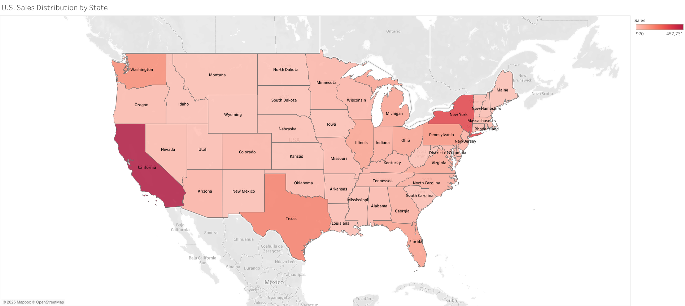
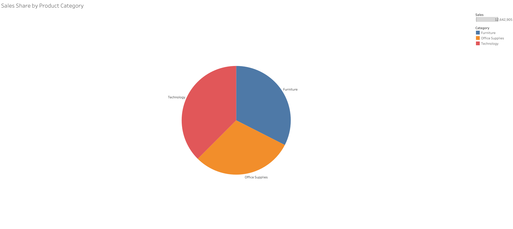
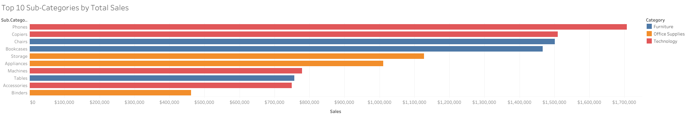
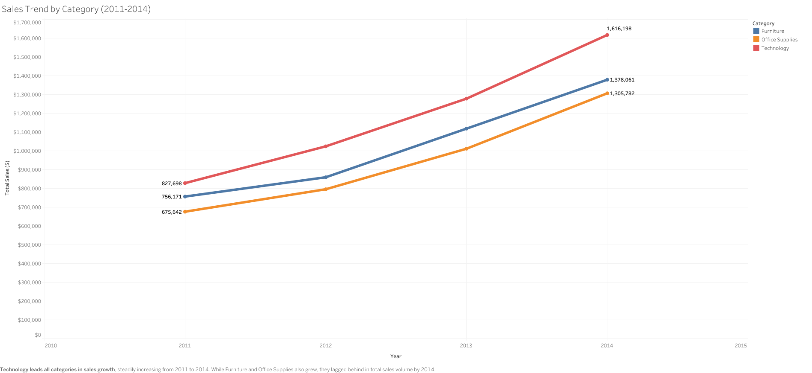

# Superstore Sales Dashboard (Tableau)

This project is an interactive data dashboard built in Tableau, designed to help users explore and analyze key performance indicators and trends. The dashboard focuses on usability, storytelling, and insight-driven design, allowing users to intuitively explore complex datasets.

## Features

- Clean and responsive layout with multi-tab navigation
- Custom filters, slicers, and drill-down interactivity
- Visual storytelling using line charts, bar graphs, and highlight tables
- Emphasis on accessibility and end-user experience

## Extended Description

This dashboard was built using the popular Superstore dataset, which simulates retail sales data across categories like Office Supplies, Furniture, and Technology. It’s designed to help users analyze regional performance, segment profitability, and sales trends through a highly visual and user-driven interface.

### Key Features:

- **Sales & Profit Analysis:**  
  Analyze metrics like sales, profit margins, and order volume across regions, categories, and segments.

- **Time-Based Trends:**  
  Explore monthly and yearly performance to identify seasonal trends and cycles.

- **Top/Bottom Performance:**  
  Identify best and worst performing product lines and regions to support inventory and marketing decisions.

- **User Interactivity:**  
  Includes filters and clickable visual elements that enhance user-driven exploration.

- **Clean UX & Storytelling:**  
  The layout prioritizes simplicity, flow, and visual hierarchy to guide user insight.

---

## Tools Used

- Tableau Desktop
- Data visualization & dashboard UX principles

## Live Demo

[View the live dashboard](https://us-east-1.online.tableau.com/#/site/shaamvisualanalytics/workbooks/2619872?:origin=card_share_link)

## Files

- `Rosario_Dawryn_Dashboard.twbx`: Tableau workbook
- `dashboard-screenshots/`: images of the dashboard interface

## Dashboard Previews

### U.S. Sales Distribution by State

---

### Sales Share by Product Category

---

### Top 10 Sub-Categories by Total Sales

---

### Sales Trend by Category (2011–2014)

## Key Takeaways

This dashboard demonstrates advanced use of Tableau for data exploration and stakeholder communication. Built with scalability and decision-making in mind, it reflects strong visual design principles and a user-first approach.
